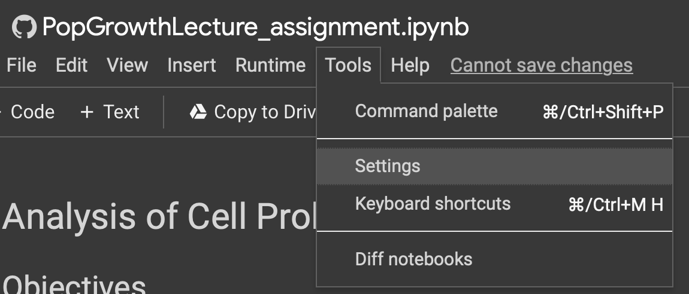
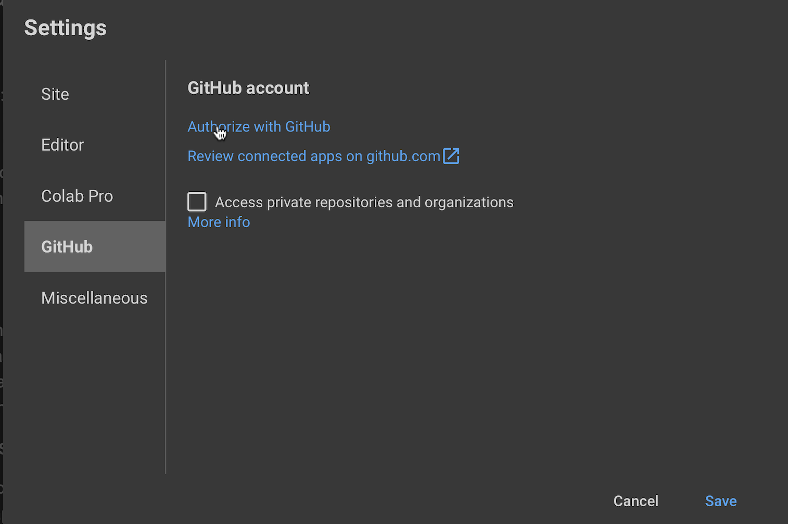
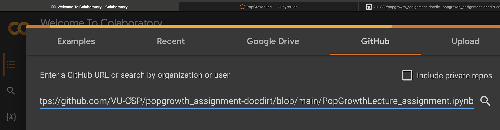

# Cell proliferation and population growth models assignment
Open the file [PopGrowthLecture_assignment.ipynb](PopGrowthLecture_assignment.ipynb) and follow the instructions within the file.  

##### If you plan to use Colab, open [Google Colab](https://colab.research.google.com) in new tab/window.  

##### You must link Colab to your GitHub account to allow you to save your file into your assignment GitHub repository.  

* Open `Tools/Settings`  
  

* Open `Settings/GitHub`  
  

##### To open the notebook in Colab  
Search for the file within your assignment GitHub repository. (Copy the link to the file shown above and search in Colab.)

* Paste GitHub file name into box  

